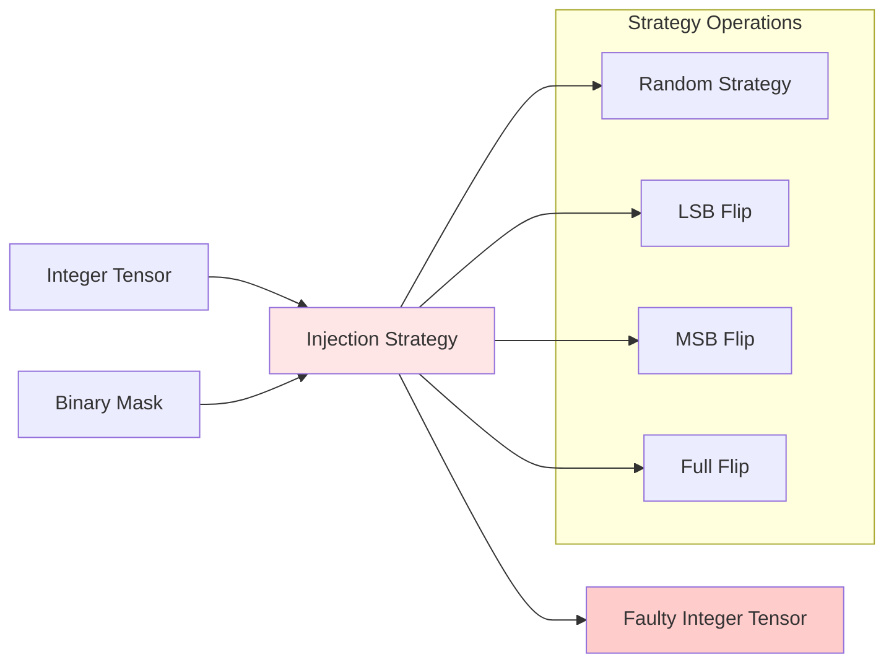
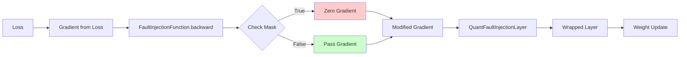

# QuantFaultInjectionLayer Class
The QuantFaultInjectionLayer is the core component of fault injection system, responsible for intercepting QuantTensor activations, determining which values to modify, applying injection strategy, and ensuring proper gradient flow during backpropagation. This layer is automatically inserted into models by FaultInjector.

## Overview
The fault injection layer operates on Brevitas QuantTensor objects, which contain both the activation values and quantization parameters. By working with QuantTensors, the layer can properly handle quantized activations while maintaining the quantization information through to the output.

The layer implements the complete fault injection workflow:

1. **Configuration validation**: Check if injection should occur based on enabled flag and probability
2. **Mask generation**: Create a binary mask indicating which activations to modify
3. **Strategy application**: Apply the selected injection strategy to masked positions
4. **Gradient handling**: Ensure gradients flow correctly, zeroing at faulty positions
5. **Statistics recording**: Track injection metrics if statistics are enabled
6. **Output construction**: Return a QuantTensor with modified values and original quantization parameters

## QuantTensor Handling
Working with QuantTensors requires careful handling of both activation values and quantization parameters.

### QuantTensor Structure
A Brevitas QuantTensor contains several key components:

- **value**: The actual activation tensor values in floating-point representation
- **scale**: The quantization scale factor for converting to/from integer representation
- **zero_point**: The zero-point offset in quantization
- **bit_width**: Number of bits used for quantization
- **signed**: Whether the quantization uses signed or unsigned integers
- **training**: Whether model is in training mode

The fault injection layer must preserve all of these parameters in the output QuantTensor. This ensures that quantization context is maintained throughout the network, allowing subsequent layers to correctly interpret the quantized values.

### Integer Conversion
Before applying fault injection strategies, the layer converts floating-point values to integer representation:

```python
inv_scale = 1.0 / scale
int_tensor = torch.round(x.value * inv_scale).to(torch.int32)
```

This conversion is necessary because fault injection strategies operate on integer bit patterns. The integer representation represents the actual quantized value that would be stored in hardware, making it the appropriate representation for simulating hardware faults.

After faults are injected, the values are converted back to floating-point using the scale:

```python
injected_float = injected_int.float() * scale
```

This conversion ensures that the output QuantTensor has the same scale and zero-point as the input, maintaining consistency in quantization representation.

## Mask Generation
The layer determines which activations to modify based on the configured probability.

### Probability Calculation
The probability parameter specifies the percentage of activations that should have faults injected. However, due to the discrete nature of sampling, the exact number of injections varies slightly around the target.

The layer calculates the exact number of elements to inject:

```python
total_elements = torch.numel(x.value)
num_to_inject = int(self.probability / 100.0 * total_elements)
```

For example, with a probability of 5.0% and 1000 total elements, approximately 50 elements would be selected for injection.

### Random Selection
The layer uses random permutation to select which specific positions to inject faults into:

```python
flat_indices = torch.randperm(total_elements, device=device)[:num_to_inject]
```

This creates a random ordering of all positions and selects the first N positions where N is the number of injections. The use of random permutation ensures that:

- **No duplicate selections**: Each position is selected at most once
- **Uniform distribution**: All positions have equal probability of being selected
- **Reproducible with seed**: Random seed controls which positions are selected

### Mask Creation
From the selected indices, the layer creates a boolean mask:

```python
condition_tensor = torch.zeros(total_elements, dtype=torch.bool, device=device)
condition_tensor[flat_indices] = True
condition_tensor = condition_tensor.view(shape)
```

This mask has the same shape as the input tensor, with True values at positions where faults should be injected and False values elsewhere. The mask is then used with injection strategies and gradient zeroing.

### Early Exit Optimization
If the mask contains no True values (no faults to inject), the layer returns early without any further processing:

```python
if not condition_tensor.any():
    return x
```

This optimization avoids unnecessary computation when no faults are to be injected, which is common when probability is set to 0.0 or for batches with very few elements.

## Strategy Application
Once the mask is generated, the layer applies the selected injection strategy.

### Strategy Execution Flow


The layer delegates the actual fault injection to the strategy object, which implements specific fault model. The layer passes the integer tensor, the binary mask, and quantization parameters (bit_width, signed) to the strategy's inject() method.

The strategy returns a new integer tensor with faults applied at the masked positions. The layer then converts this back to floating-point and constructs the output QuantTensor.

Different strategies implement different fault models:

- **RandomStrategy**: Replaces values with random integers within the valid quantization range
- **LSBFlipStrategy**: Flips the least significant bit, toggling between even and odd values
- **MSBFlipStrategy**: Flips the most significant bit, causing large magnitude changes
- **FullFlipStrategy**: Inverts all bits, computing the bitwise complement

The strategy can be changed at runtime by updating the layer's strategy attribute, allowing for dynamic fault models during training.

## Gradient Flow and Backpropagation
The layer ensures proper gradient flow during backpropagation, which is critical for fault-aware training.

### Gradient Zeroing
To train models that are robust to faults, gradients at positions where faults were injected must be zeroed. This prevents the model from learning to predict the faulty values that were artificially introduced.

The layer achieves this through FaultInjectionFunction, which is a custom autograd function. During the backward pass, this function receives the upstream gradient and the fault mask from the forward pass:

```python
grad_x = torch.where(mask, torch.zeros_like(grad_output), grad_output)
```

At positions where the mask is True (fault was injected), the gradient is set to zero. At positions where the mask is False (no fault), the gradient passes through unchanged.

This gradient handling is key to fault-aware training. If gradients were not zeroed at faulty positions, the model would learn to compensate for the specific fault values we injected, which would not generalize to real faults that occur at different positions.

### Backpropagation Flow



The modified gradient flows back through the injection layer to the wrapped layer. The wrapped layer then uses this gradient to update its parameters during the optimizer step. Because gradients at faulty positions are zeroed, the wrapped layer does not adjust its weights to compensate for the injected faults, instead learning to produce activations that are robust to such errors.

## Statistics Tracking
The layer can record statistics about injection behavior for analysis.

### Recording Process
When a FaultStatistics object is attached to the layer, it records information about each injection event:

```python
if self.statistics is not None:
    self.statistics.record(
        clean_int=int_tensor,
        faulty_int=injected_int,
        mask=condition_tensor,
        layer_id=self.layer_id,
    )
```

The statistics system tracks:

- **Injection counts**: Number of activations that were modified
- **Actual rate**: Percentage of activations that were modified
- **Error magnitude**: Root mean squared error (RMSE) between clean and faulty values
- **Output similarity**: Cosine similarity between clean and faulty tensors

This information helps analyze the impact of fault injection and understand the relationship between the configured probability and the actual number of injections that occur.

### Verbose Output
When verbose mode is enabled, the layer prints information about each injection event:

```python
if self.verbose:
    num_injected = condition_tensor.sum().item()
    total = condition_tensor.numel()
    print(
        f"Layer {self.layer_id}: Injected {num_injected}/{total} "
        f"({100.0 * num_injected / total:.2f}%)"
    )
```
This output is useful for debugging and for understanding the actual injection behavior versus the configured parameters.

## Configuration and Control
The layer provides several configuration options for controlling fault injection behavior.

### Enable/Disable
The injection_enabled flag controls whether the layer injects faults on forward pass. This can be toggled at runtime:

```python
layer.set_enabled(enabled=False)  # Disable injection
layer.set_enabled(enabled=True)   # Enable injection
```

When disabled, the layer acts as a pass-through, returning the input QuantTensor unchanged. This is useful for:

- **Ablation studies**: Comparing model performance with and without faults
- **Debugging**: Temporarily disabling faults to isolate other issues
- **Evaluation phases**: Only injecting faults during specific evaluation runs

### Probability Update

The injection probability can be updated dynamically:

```python
layer.set_probability(probability=10.0)
```

The probability takes effect immediately on the next forward pass. This enables:

- **Annealing strategies**: Gradually reducing or increasing fault rate during training
- **Curriculum learning**: Starting with no faults and gradually introducing them
- **Phase-specific probabilities**: Using different probabilities during different training phases

### Layer Identification

Each layer is assigned a unique layer_id during creation. This identifier is used for:

- **Statistics reporting**: Organizing statistics by layer
- **Layer-specific configuration**: Targeting updates to specific layers
- **Debugging**: Identifying which layer produced particular output

The layer_id is managed by the FaultInjector, which ensures that each injection layer has a unique identifier.

## Phase Control

The layer does not directly handle training versus evaluation phase control. Instead, this is managed at the configuration level through FaultInjectionConfig and by the training code.

The training code is responsible for setting the model to the appropriate mode:

```python
model.train()   # Set to training mode
model.eval()    # Set to evaluation mode
```

The FaultInjectionConfig specifies whether faults should be applied during training, evaluation, or both. The training code ensures that the model is in the correct mode, and the FaultInjector verifies the configuration during the inject() call.

## Performance Considerations

The fault injection layer is designed to have minimal performance overhead.

### Computational Overhead

The main computational cost comes from:

- **Mask generation**: Random permutation and mask creation
- **Integer conversion**: Conversion to and from integer representation
- **Strategy application**: Applying the fault injection strategy

These costs are:

- **Linear in tensor size**: Scales with the number of activations
- **Negligible for large models**: The cost is small compared to actual layer computation
- **Only when enabled**: No overhead when injection is disabled

### Memory Overhead

The layer creates several temporary tensors during the forward pass:

- **Mask tensor**: Boolean tensor for fault positions
- **Integer tensor**: Converted integer representation
- **Faulty tensor**: Result after strategy application

These tensors are freed after the forward pass completes, so there is no persistent memory overhead. The peak memory usage is approximately three times the size of the input tensor during the injection operation.

### Batch Processing

The layer handles batched inputs efficiently. The mask generation and strategy application work correctly across batches, with faults potentially distributed across different samples in the batch according to the global probability setting.

## API Reference
::: utils.fault_injection.layers.QuantFaultInjectionLayer